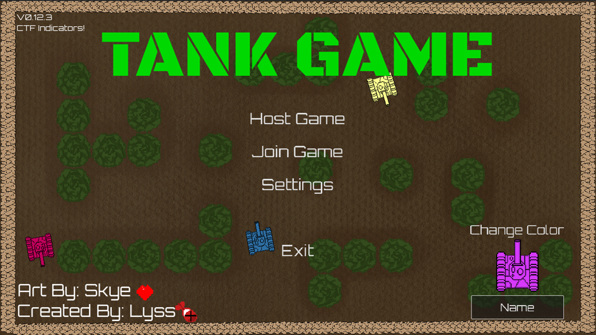
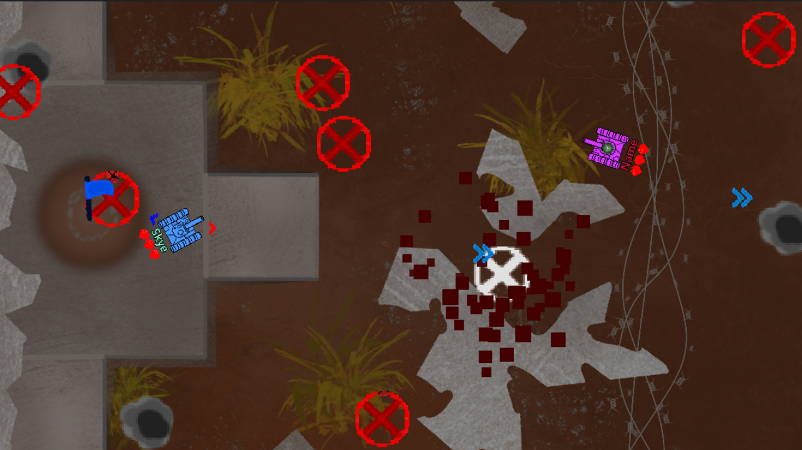
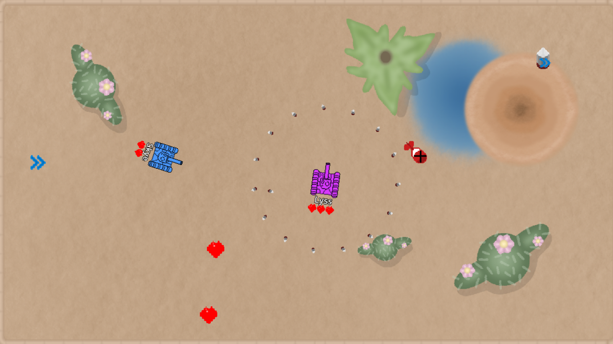
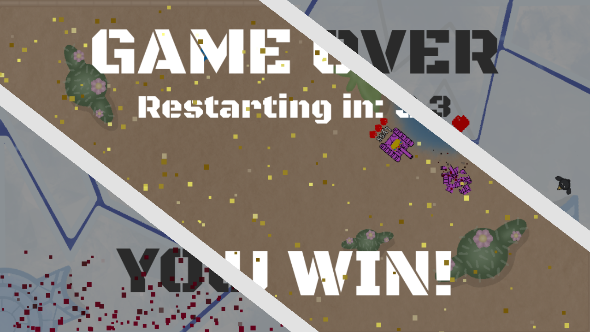

# Tank Game (v0.14.3) - King of the Hill!

A multiplayer, top-down tank battle game built in the Godot engine. Drive around chaotic arenas, shoot your friends (or CPUs), grab powerups, and survive hazards like cracking ice and raining nukes. Last tank standing wins!

##  Features

* **Networked Multiplayer:** Host a server or join friends over IP (default port: `8910`).
* **AI-Controlled CPUs:** Fill empty slots with bots that pathfind toward enemies and objectives.
* **5 Dynamic Maps:** Features a random map rotation between rounds (the last played map is excluded from the next pick).
* **Three Game Modes:**
    * **Free-For-All (FFA):** Last tank standing wins.
    * **Capture the Flag (CTF):** Steal the enemy flag and bring it back to your base.
	* **King of the Hill (KOTH):** Stay on the hill for 15 seconds alone and win.
* **Game Changing Powerups:**
    * *Health Boost* Gain 1 heart
	* *Golden Heart* Gain 3 hearts, but slow down for a few seconds
    * *Nuke:* Rains 25 explosions across the map.
    * *Big Shot:* A massive, penetrating shell.
    * *Triple Shot / 360° Shot:* Devastating multi-shell spreads.
    * *Speed boost:* Speed increased, but your forced to go forward
	* *Reverse Speed boost:* Same as above but backwards
	* *Shield:* Stops one shot, exluding nukes
* **Map Hazards:** Watch out for cracking ice tiles, falling nuke strikes, a spinning sand pit that reverses your controls, and prickly cacti.
* **Customization & Cosmetics:** Pick your name and tank color. Plus, winners get a fun hat to wear during the next match!
* **Persistent Settings:** Player name, color, last connected server, volume, and fullscreen preferences save automatically between sessions.
* **Win/Lose Screen** Custom screens for winning/losing with particles/sound effects

---

##  Controls

* **`W` `A` `S` `D`** - Movement
* **`SPACEBAR`** - Fire Shot
* **`ESC`** - Leave current game / Return to main menu

---

##  How to Play / Install

1. Download the latest build from the **[Releases](https://github.com/GreyChaos/Tank-Game/releases)** page.
2. Extract the ZIP file and run `TankGame.exe`
3. Choose **Host** or enter your friend's IP address to **Join**.

---

> **Note on AI:** No generative AI was used for the art or final code of this game. It was utilized strictly as a tool for debugging assistance.